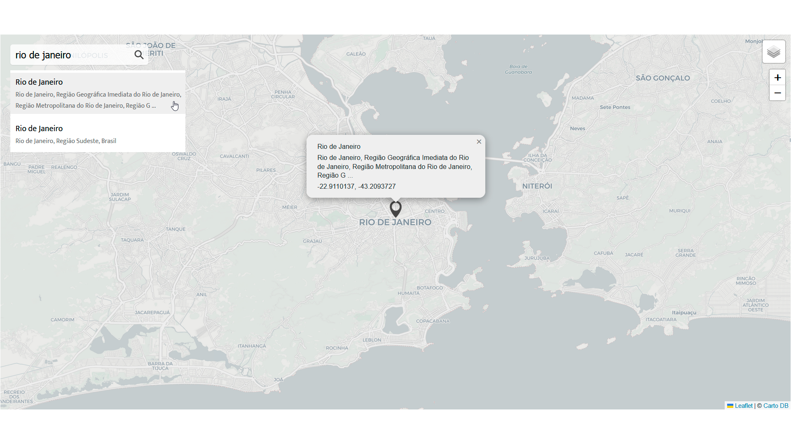

# To-Do List ✅

A reac-leaflet and leaflet map inside a project with Next.js. Leaflet is an open source JavaScript library that helps us build virtual mapping applications such as this one.

Check it out:
https://www.ccorgz.com/projetos/leafletMap

## Screenshots

